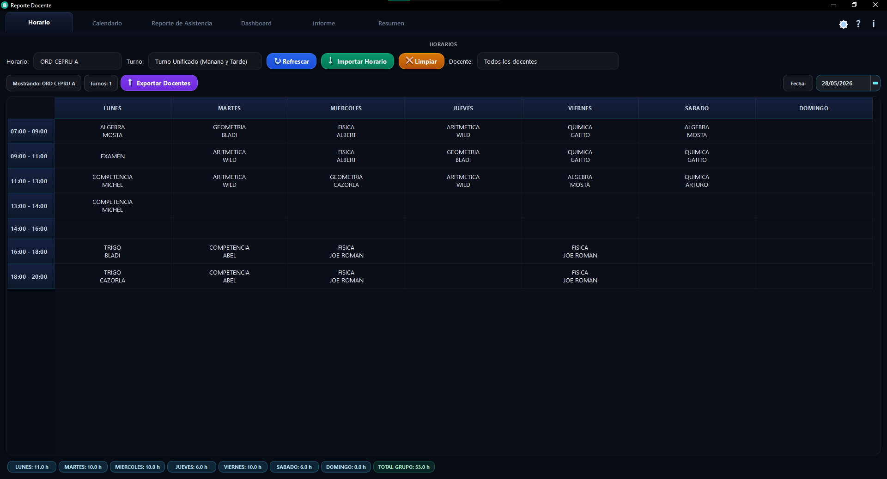
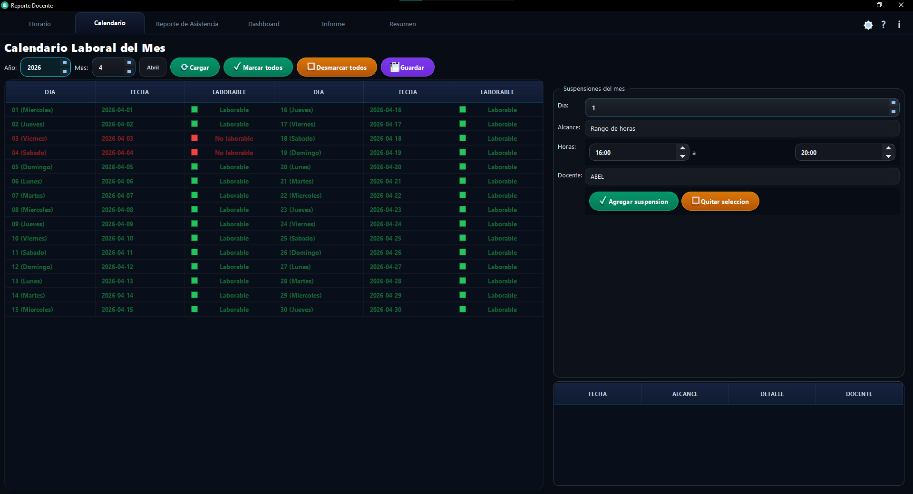
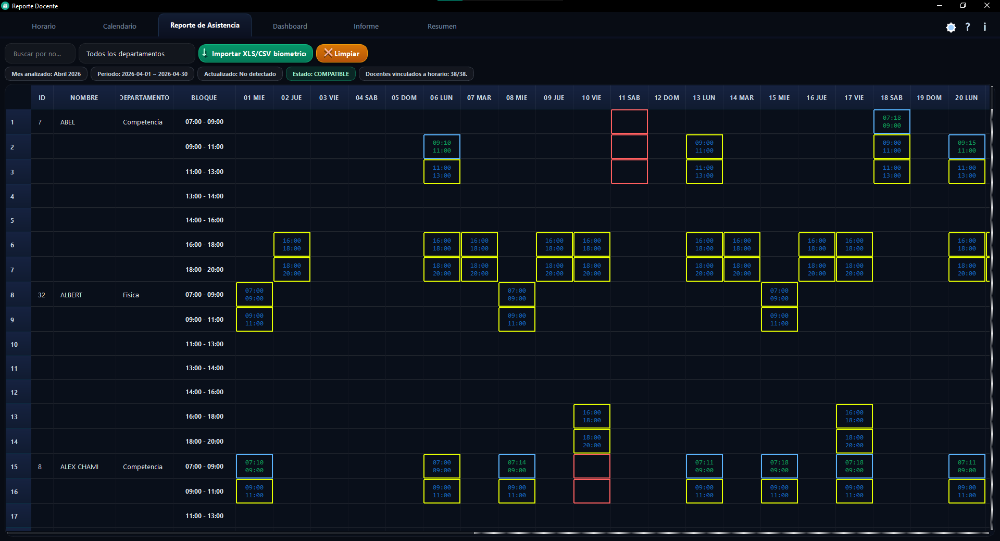
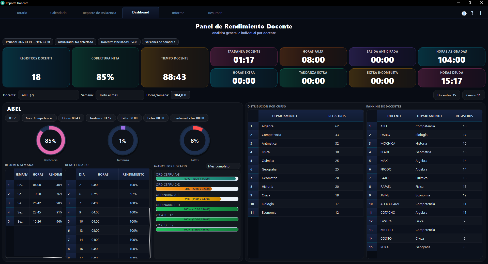
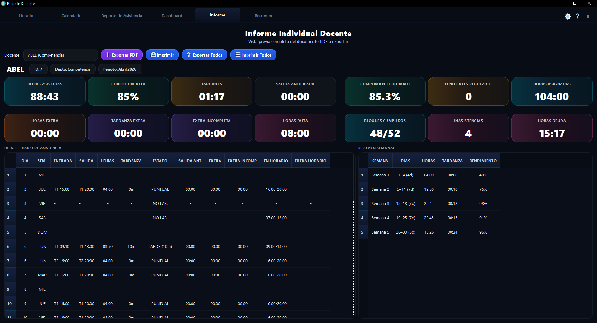
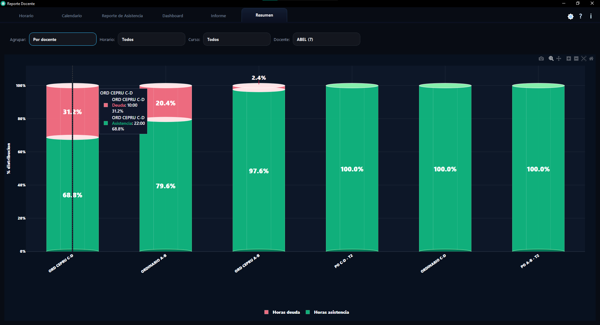

# Informe Docente Academia Pardo

Sistema de escritorio para el control academico de docentes. Permite importar horarios, procesar registros biometricos, configurar calendario laboral, registrar suspensiones, calcular metricas de cumplimiento y generar informes PDF profesionales por docente.

El objetivo del sistema es centralizar el seguimiento de asistencia docente, diferenciando horas asistidas, tardanzas, salidas anticipadas, horas extra, faltas, suspensiones y deuda horaria.

## Caracteristicas principales

- Gestion de horarios docentes por modalidad, curso y bloque horario.
- Importacion de registros biometricos desde archivos XLS/CSV.
- Construccion automatica de slots horarios por docente y dia.
- Calendario laboral editable por mes.
- Soporte para feriados, dias no laborables y suspensiones.
- Calculo de horas asignadas, asistidas, faltas, tardanzas, salidas anticipadas, extras y deuda.
- Dashboard general con indicadores docentes.
- Reporte detallado por docente y por dia.
- Informe mensual con tablas de asistencia y resumen semanal.
- Resumen visual con grafico de distribucion entre asistencia y deuda.
- Exportacion e impresion de informes PDF.

## Vista del proyecto

### 1. Horario



### 2. Calendario



### 3. Reporte



### 4. Dashboard



### 5. Informe



### 6. Resumen



## Modulos del sistema

### Dashboard

Muestra indicadores generales de cumplimiento, asistencia, deuda, horas asignadas y comportamiento mensual de los docentes.

### Horario

Permite cargar y visualizar los horarios academicos. Estos horarios son la base para construir los slots evaluables del reporte.

### Calendario

Permite configurar dias laborables, no laborables, feriados y suspensiones. Las suspensiones pueden aplicarse por dia completo, turno, horario especifico o rango de horas.

### Reporte

Procesa los registros biometricos y los cruza con los horarios cargados. Identifica asistencias, faltas, tardanzas, salidas anticipadas, horas extra y bloques suspendidos.

### Informe

Presenta el resumen mensual por docente, incluyendo detalle diario, resumen semanal, metricas principales y exportacion PDF.

### Resumen

Visualiza la distribucion porcentual entre horas asistidas y horas deuda, agrupada por horario, curso o docente.

## Tecnologias

- Python 3.13.11
- PySide6
- ReportLab
- Plotly
- Pandas
- xlrd
- Pytest

## Instalacion

Clonar el repositorio:

```powershell
git clone https://github.com/WaldirHuanquiJ/Informe-Docente-Academia-Pardo.git
cd Informe-Docente-Academia-Pardo
```

Crear entorno virtual:

```powershell
python -m venv reporte
```

Activar entorno virtual:

```powershell
.\reporte\Scripts\activate
```

Instalar dependencias:

```powershell
pip install -r requirements.txt
```

## Ejecucion

```powershell
python .\reporte_gui\main.py
```

Tambien se puede ejecutar usando el Python del entorno:

```powershell
.\reporte\Scripts\python.exe .\reporte_gui\main.py
```

## Estructura principal

```text
reporte_gui/
  app/
    services/      Logica de procesamiento, calendario, horarios, PDF y metricas
    ui/            Interfaces de usuario PySide6
    models.py      Modelos principales del sistema
  tests/           Pruebas automatizadas
  main.py          Punto de entrada de la aplicacion
capturas/          Imagenes de presentacion del proyecto
img/               Recursos graficos del sistema
```

## Datos locales

Los archivos de datos reales, logs, builds, instaladores y reportes generados localmente no se versionan en este repositorio.

Esto evita subir informacion sensible como:

- Registros biometricos.
- Horarios institucionales reales.
- Reportes PDF generados.
- Archivos temporales de sesion.
- Ejecutables e instaladores.

## Estado del proyecto

Proyecto en desarrollo activo, orientado a uso interno academico y mejora continua del motor de calculo de asistencia docente.
